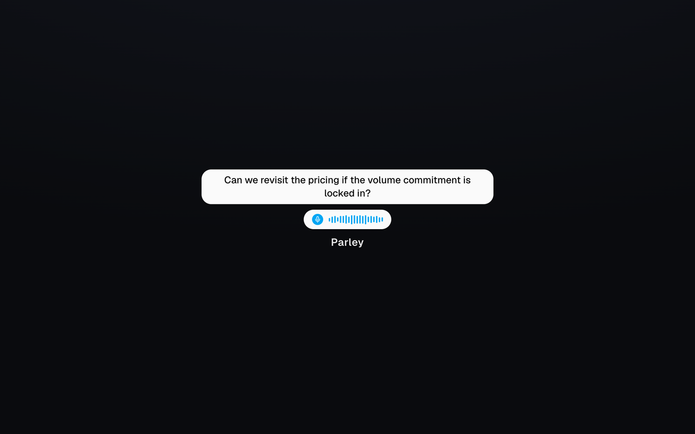

# Parley

<p align="center">
  
</p>

<p align="center">
  <strong>A local-first AI copilot for high-stakes conversations — live coaching and real-time voice translation during the call, structured intelligence and deep retro after it.</strong>
</p>

<p align="center">
  <a href="https://github.com/pathorsAI/parley/releases/latest"></a>
  <a href="https://github.com/pathorsAI/parley/actions/workflows/release.yml"></a>
  <a href="LICENSE"></a>
  <a href="https://tauri.app/"></a>
  
</p>

<p align="center">
  
</p>

Parley is a native, local-first **AI copilot for high-stakes conversations** — built first for **sales calls, negotiations, and partnership talks**, though it works just as well for interviews, diligence calls, or any conversation you want to walk into prepared and walk out of having learned from. It's for the person in the seat: a rep, a founder, anyone closing a deal.

One meeting, three layers of help:

- **🎙️ Live — during the call.** Dual-source capture, diarized real-time transcription, a **coach feed** of evaluation alerts and grounded answers, and an **intelligence board** that extracts the state of the deal as it unfolds.
- **🌐 Translate — across languages.** Speak your language; the meeting hears the other one. Gemini-powered speech-to-speech translation flows out through Parley's own **virtual microphone**, so Google Meet or Zoom pick it up like any mic.
- **📼 Study — after the call.** Stopping a meeting lands on its auto-generated debrief. Replay any recording through four lenses: brief, intelligence, full transcript, and delivery scorecard — including opponent war-gaming and moment-by-moment counterfactuals.

> [!WARNING]
> **macOS only (for now).** Parley relies on a Core Audio process tap for system-audio capture and ships a CoreAudio virtual-microphone driver. The audio pipeline is abstracted behind an `AudioSource` trait, making other platforms theoretically possible, but only macOS is officially supported today.

---

## Table of Contents

- [Features](#-features)
- [Privacy & Data Flow](#-privacy--data-flow)
- [Installation](#-installation)
- [Voice Typing](#%EF%B8%8F-voice-typing)
- [Contributing](#-contributing)
- [License](#-license)

---

## 🎯 Features

### 🎙️ Live — during the call

<p align="center">
  
</p>

- **Dual-source capture** — both your mic and the other party's system audio, tagged `me` / `them`.
- **Real-time transcription** — live, diarized transcription with editable speaker names.
- **Coach feed** — one stream, one voice: evaluation alerts (negotiation risk, qualification gaps, red flags, your own rubric), each with a drill-down into *how to reply*, plus grounded Q&A answers inline. Ask anything from the input bar — <kbd>Tab</kbd> completes a rotating suggested question.
- **Two postures, one switch** — flip the titlebar-center control between **Coach** (transcript rail · coach feed · intelligence board) and **Transcript** (full-width reading view).
- **Auto-checked agenda** — goal items tick off as the AI detects they're covered.
- **Delivery coaching** — live pace, pitch-variation, and pause nudges measured on your own mic only.

### 🌐 Real-time voice translation

Speak Mandarin; the meeting hears English (or any of 70+ languages) — live, continuously, with your intonation preserved.

- **Translated meetings** — flip one switch and your side of the meeting runs through `gemini-3.5-live-translate-preview`: the translated **voice** goes out to the meeting, while the bilingual transcript (what you said → what they heard) feeds the coach, analysis, and history like any other meeting.
- **Parley Microphone** — a Developer-ID-signed CoreAudio virtual microphone that ships inside the app with **one-click install** (native macOS admin prompt, no Terminal). Select it as the mic in Google Meet / Zoom / Teams and the translation is what they hear.
- **Interpreter strip** — a slim in-meeting bar with the live original → translation line, outgoing level, an honest running cost ticker, and a **pause** switch (paused = silence to the other side, zero tokens billed). Pop it out into an always-on-top HUD for when the meeting app is fullscreen.
- **Quick interpreter** — a standalone window for non-meeting use (in-person conversations, calls), with the same engine.
- **The other side stays native** — their audio keeps your configured STT provider, diarization included.

### 🧠 The intelligence board

<p align="center">
  
</p>

Parley is not a note-taker. Tell it what kind of meeting this is, and the board **extracts the structured state of the conversation** as it happens (auto-refreshing while you talk):

| Meeting type | What the board tracks |
|---|---|
| ⚖️ **Negotiation** | A **numbers ledger** (every figure said, and by whom), the **concession ratio** between sides, agreed vs. open terms |
| 🤝 **Sales** | Budget / timeline / decision-maker signals, an **objection tracker** (answered vs. still open), a commitment ledger, competitor mentions |
| 🚀 **Partnership** | A live *they-have × they-need* position map, **concrete mutual-leverage proposals** (including help-them-first plays), give/get balance |

The coach feed tells you *what just happened*; the board tells you *where the deal stands*.

### 📼 Study — after the call

<p align="center">
  
</p>

Stopping a meeting slides straight into its debrief. Any recording — just finished, from history, or dragged in as an audio file — opens through four tabs:

- **Brief** — an auto-generated debrief: summary, both sides' commitments, open items, suggested next steps.
- **Intel** — the intelligence board's final state, extracted over the full recording.
- **Transcript** — the full player: scrub to any moment and re-run the analysis *as of that point*, a time-anchored timeline of the other side's moves and your missed moments, **opponent war-gaming** (their key arguments, the premise you shouldn't concede, response angles with predicted reactions), and full Q&A over the call.
- **Delivery** — your speaking scorecard: pace, monotone stretches, pauses, filler words.

Plus: **LLM speaker re-attribution** fixes diarization drift by conversational context, and on-device voice re-diarization runs automatically after every save.

### 🧩 Yours, and private

- **Bring your own providers** — pick your transcription vendor (Soniox, Deepgram, AssemblyAI, OpenAI, Gemini) and LLM (Claude, OpenAI, Gemini, Groq, Ollama, OpenRouter, and more).
- **Local-first** — audio and transcripts go straight to the providers you configure; no Pathors AI proxy in between.
- **Signed & notarized** — releases are Developer-ID signed and Apple-notarized, virtual-mic driver included.
- **Built-in MCP server** — connect Claude (or any MCP client) to the live meeting while the app is open: read the transcript, manage agenda TODOs, and read/edit the timeline analysis.
- **Voice typing** — system-wide push-to-talk dictation in any app (see [Voice Typing](#%EF%B8%8F-voice-typing)).
- **Traditional Chinese** — full zh-TW UI and on-the-fly conversion of transcribed text.
- **Native macOS UI** — clean, custom window chrome.

---

## 🔒 Privacy & Data Flow

Conversation content is sensitive. Parley runs straight from your machine:

* **Direct connections** — audio and transcripts go straight to the providers *you* configure — no Pathors AI proxy in between. With live translation enabled, your mic audio streams directly to Google's Gemini API under your own key.
* **Local storage** — transcripts, recordings, and templates stay in your local app directory.
* **No telemetry** — nothing tracked, collected, or uploaded.

---

## 📥 Installation

### Install

Download the latest macOS build from the [**Releases page**](https://github.com/pathorsAI/parley/releases/latest), open the `.dmg`, and drag **Parley** into your Applications folder. Builds are signed and notarized — no Gatekeeper hoops.

Paste your API keys in **Settings** inside the app; to use live translation, add a Gemini API key under **Settings → Live translation** and install the Parley Microphone with one click.

### Build from source

**Prerequisites**

- **Rust** (stable toolchain) — for the Tauri backend
- **Bun** (or Node.js) — for building the frontend
- A **transcription provider** API key (e.g. Soniox, Deepgram, AssemblyAI) — for transcription (live and uploaded recordings)
- An **LLM provider** API key (Anthropic, OpenAI, OpenRouter, …) — for evaluations, Q&A, the intelligence board, and retro analysis
- *(optional)* a **Gemini** API key with `gemini-3.5-live-translate-preview` access — for live voice translation

1. Clone the repository and install dependencies:
   ```bash
   git clone https://github.com/pathorsAI/parley.git
   cd parley
   bun install
   ```

2. Run the application in development mode:
   ```bash
   bun run tauri dev
   ```

3. *(optional)* Build and install the virtual-microphone driver for translation into meetings:
   ```bash
   cd virtual-mic && ./build.sh && ./install-dev.sh
   ```

---

## 🎙️ Voice Typing

<p align="center">
  
</p>

Beyond meetings, Parley doubles as a **system-wide push-to-talk dictation tool** that works in any app. It doesn't use macOS Dictation — it runs its own microphone capture and realtime STT pipeline, so the output uses whichever transcription provider you configured in Settings.

Hold your push-to-talk key anywhere, speak, and release to transcribe. On release, Parley copies the text to the clipboard and auto-pastes it into the frontmost app (clipboard stays the fallback when Accessibility isn't granted).

Pick the trigger in **Settings → Voice typing**:

- **`Option+Space`** — the default; needs no extra permission.
- **Any recorded combo** — click the recorder and press the shortcut you want (e.g. `⌃⌥Space`, `⌘⇧D`, or an F-key). Also permission-free.
- **A single hold-to-talk key** — `fn`/Globe or a right-side `⌘`/`⌥`/`⌃`. These need Input Monitoring (grant it, then relaunch).

Auto-paste needs Accessibility; Parley requests it when you enable voice typing.

---

## 🤝 Contributing

Contributions are welcome! Please see [CONTRIBUTING.md](CONTRIBUTING.md) for guidelines on how to report bugs, suggest features, and submit pull requests.

---

## 📄 License

Licensed under the [Apache License 2.0](LICENSE). Copyright 2026 Pathors AI.
