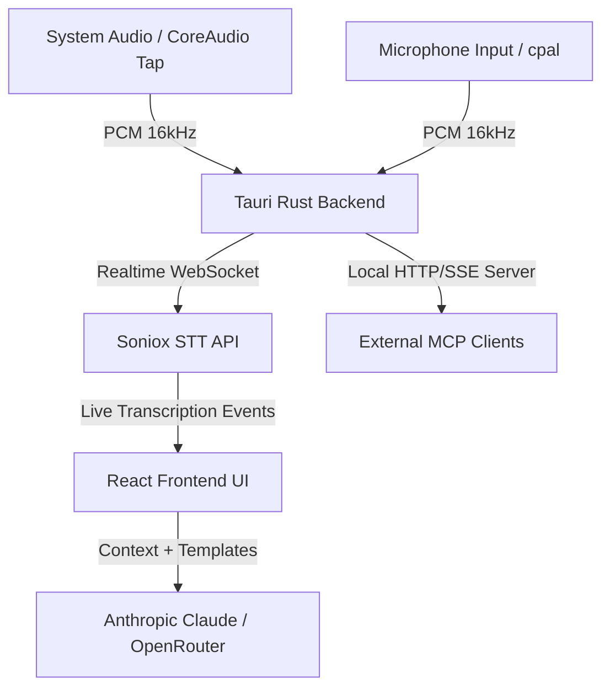

# Parley

<p align="center">
  
</p>

<p align="center">
  <strong>A native, local-first meeting copilot for real-time transcription, Q&A, and auto-checklists.</strong>
</p>

<p align="center">
  <a href="https://github.com/pathorsAI/parley/actions/workflows/release.yml"></a>
  <a href="LICENSE"></a>
  <a href="https://tauri.app/"></a>
  
</p>

Parley is a native, real-time meeting copilot designed for interviews, negotiations, and discussions. It captures audio from both your microphone (you) and your system output (the other party), transcribes the conversation live with speaker diarization, and runs customizable AI evaluation checklists and a live Q&A sidebar—helping you stay focused on the conversation while getting instant insights in the background.

> [!WARNING]
> **macOS only (for now).** Parley relies on a Core Audio process tap for system-audio capture. The underlying audio pipeline is abstracted behind an `AudioSource` trait, making other platforms theoretically possible, but only macOS is officially supported today.

---

## 🎯 Features

- **Dual-Source Capture** — Simultaneously captures your microphone and system audio (e.g. Zoom, Meet, Teams) and tags transcript lines as `me` or `them`.
- **Soniox Real-Time Transcription** — Low-latency, streaming transcription with high-accuracy speaker diarization and editable speaker names.
- **Switchable AI Providers** — Run live evaluations and Q&A using either **Anthropic Claude** or any model on **OpenRouter**.
- **Live Q&A Sidebar** — Ask questions about the live transcript as the conversation happens and receive streamed answers.
- **Configurable Evaluations** — Customize evaluation checklist cards that flag specific talking points, concerns, or milestones.
- **Auto-check TODOs** — Track your agenda items; Parley automatically checks items off as the AI detects they have been addressed.
- **Built-in MCP Server** — Exposes a local HTTP Model Context Protocol (MCP) endpoint while the app is open to manage templates and checklists from external clients.
- **Traditional Chinese Translation** — Instant conversion of transcribed text to Traditional Chinese on-the-fly.
- **Sleek, Native UI** — Features a clean custom window chrome built for macOS.

---

## 🏗️ Architecture

Parley is designed to run with minimal latency by separating audio streaming, UI responsiveness, and LLM processing:



---

## 🔒 Privacy & Data Flow

Meeting content is highly sensitive. Parley is built with a **local-first** approach:
* **No Middleware Servers:** All audio streams and transcriptions go directly from your local machine to the API endpoints (Soniox/Anthropic/OpenRouter).
* **Local Storage:** Transcripts and template files (`templates.json`) are stored exclusively in your local application directory.
* **No Telemetry:** We do not track, collect, or upload your transcripts, audio, or API usage statistics.

---

## ⚙️ Tech Stack

- **Shell & Core:** [Tauri v2](https://v2.tauri.app/) (Rust) + React 19 + Vite + TypeScript + Tailwind CSS v4
- **Audio Capture:** Core Audio process tap for macOS system audio, `cpal` for microphone input
- **Transcription:** Soniox WebSocket API (dual concurrent sessions)
- **AI Integrations:** Vercel AI SDK (Anthropic & OpenRouter adapters)
- **State Management:** [Zustand](https://github.com/pmndrs/zustand)

---

## 🚀 Getting Started

### Prerequisites

- **Rust** (stable toolchain) — for the Tauri backend
- **Bun** (or Node.js) — for building the frontend
- A **Soniox API Key** — for live transcription
- An **Anthropic** or **OpenRouter** API Key — for LLM capabilities

### Setup & Run

1. Clone the repository and install dependencies:
   ```bash
   git clone https://github.com/pathorsAI/parley.git
   cd parley
   bun install
   ```

2. Run the application in development mode:
   ```bash
   bun run tauri dev
   ```

3. Paste your API keys in the **Settings** panel inside the app on first launch.

---

## 🔌 Built-in MCP Server

Parley runs a local HTTP/SSE Model Context Protocol (MCP) server directly inside the desktop app. Connect any HTTP-capable MCP client (like Claude Desktop or Cursor) to the following endpoint:

```text
http://127.0.0.1:3011/mcp
```

This exposes tools to list, create, update, and delete evaluation/TODO templates synced with the application.

---

## 🗺️ Roadmap

- [ ] Support Windows system audio capture via WASAPI loopback.
- [ ] Add support for local/offline Whisper transcription.
- [ ] Add more LLM providers (Ollama, Gemini, OpenAI).
- [ ] Rich export formats (PDF, Markdown with timestamps, Notion sync).

---

## 🤝 Contributing

Contributions are welcome! If you'd like to help improve Parley:
1. Fork the repository.
2. Create a feature branch (`git checkout -b feature/amazing-feature`).
3. Commit your changes (`git commit -m 'Add amazing feature'`).
4. Push to the branch (`git push origin feature/amazing-feature`).
5. Open a Pull Request.

Please make sure to open an issue first to discuss any major changes or new features.

---

## 📦 Release

To build a release version locally and tag it:

```bash
bun run release patch --message "Release description"
```
This updates the versions in `package.json`, `tauri.conf.json`, and `Cargo.toml`, creates a release tag, and pushes it to GitHub where the release workflow builds the Universal macOS bundle.

---

## 📄 License

Licensed under the [Apache License 2.0](LICENSE). Copyright 2026 Pathors AI.

---

## 💡 Acknowledgements

Built with [Claude Code](https://claude.com/claude-code).
