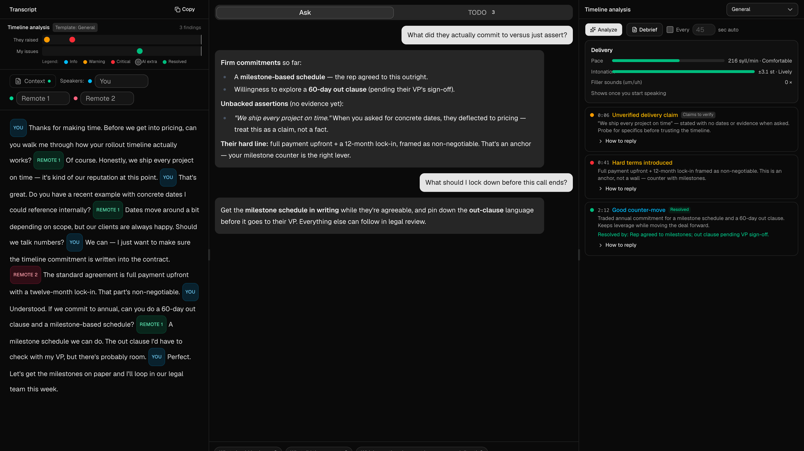
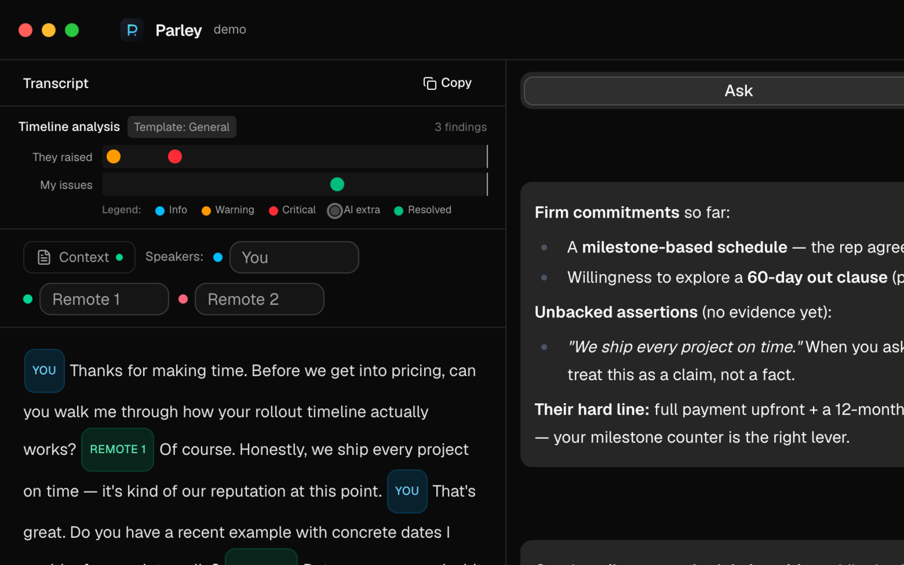
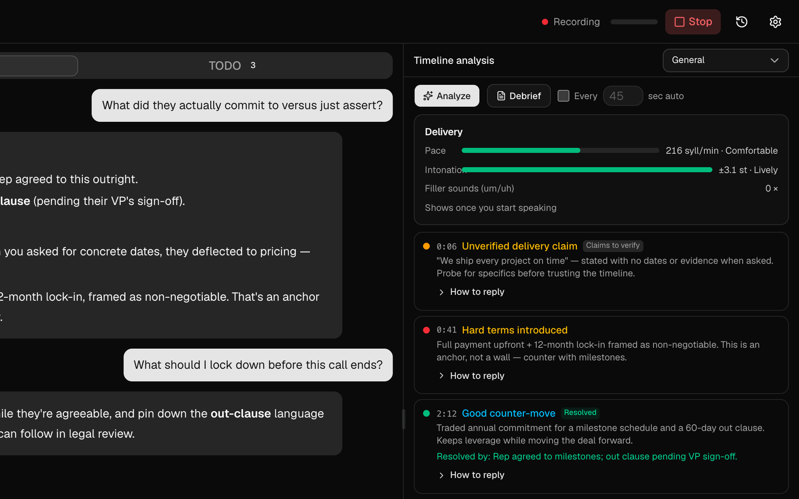
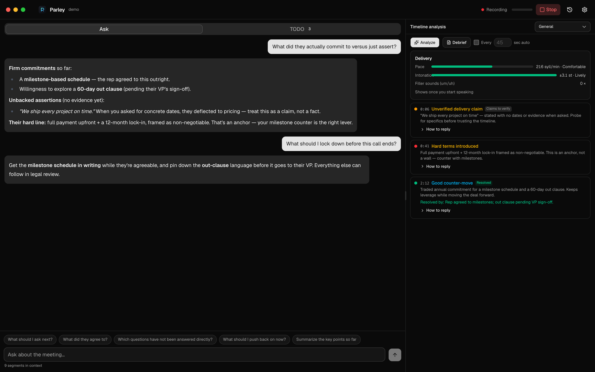

# Parley

<p align="center">
  
</p>

<p align="center">
  <strong>Real-time AI coaching for sales and negotiation calls.</strong>
</p>

<p align="center">
  <a href="https://github.com/pathorsAI/parley/releases/latest"></a>
  <a href="https://github.com/pathorsAI/parley/actions/workflows/release.yml"></a>
  <a href="LICENSE"></a>
  <a href="https://tauri.app/"></a>
  
</p>

<p align="center">
  
</p>

Note-takers tell you what happened in a call after it's over — when it's too late to change the outcome. Parley coaches you **while you can still act**: it listens to the meeting, flags what just happened, suggests what to say next, and tracks where the deal stands, live.

- 🎙️ **Coached, live** — a real-time feed of alerts and suggested replies, plus an intelligence board that extracts the state of the deal as you talk.
- 🌐 **In any language** — speak your language; the meeting hears the other one, through Parley's own virtual microphone.
- 📼 **Debriefed, after** — commitments, missed moments, opponent war-gaming, and a delivery scorecard for the next round.

**Local-first, bring your own keys.** Audio and transcripts go directly to the STT and LLM providers *you* configure (Claude, OpenAI, Gemini, Soniox, Deepgram, …). No Pathors proxy, no telemetry, everything stored on your machine.

> [!NOTE]
> **macOS only (for now).** Parley uses a Core Audio process tap for system-audio capture and ships a CoreAudio virtual-microphone driver.

---

## 📥 Install

Download the latest build from the [**Releases page**](https://github.com/pathorsAI/parley/releases/latest), open the `.dmg`, and drag **Parley** into Applications. Builds are signed and notarized — no Gatekeeper hoops.

Then paste your API keys in **Settings**: one STT provider for transcription, one LLM for coaching. For live translation, add a Gemini key and install the Parley Microphone with one click.

---

## 🎙️ During the call

<p align="center">
  
</p>

Parley captures both sides — your mic and the meeting's system audio — and transcribes them live, diarized as `me` / `them`.

On top of the transcript, the **coach feed** raises evaluation alerts (negotiation risk, qualification gaps, red flags, or your own rubric), each with a drill-down into *how to reply*. Ask it anything from the input bar and get answers grounded in the conversation so far.

<p align="center">
  
</p>

While the feed tells you *what just happened*, the **intelligence board** tells you *where the deal stands*. Tell Parley what kind of meeting this is and it extracts the structured state as you talk:

| Meeting type | What the board tracks |
|---|---|
| ⚖️ **Negotiation** | Every number said and by whom, the concession ratio between sides, agreed vs. open terms |
| 🤝 **Sales** | Budget / timeline / decision-maker signals, objections answered vs. still open, commitments, competitor mentions |
| 🚀 **Partnership** | A live *they-have × they-need* map, concrete mutual-leverage proposals, give/get balance |

Plus an auto-checked agenda and live delivery nudges (pace, pitch, pauses) measured on your mic only.

---

## 🌐 Live voice translation

Speak Mandarin; the meeting hears English — live, in 70+ languages, with your intonation preserved.

Flip one switch and your side of the call runs through Gemini speech-to-speech translation, out through the **Parley Microphone** — a signed CoreAudio virtual mic that installs with one click. Select it as your mic in Google Meet, Zoom, or Teams, and the translation is what they hear. The other side stays on your regular transcription pipeline, and the bilingual transcript feeds the coach like any other meeting.

A slim **interpreter strip** shows the live original → translation line, a running cost ticker, and a pause switch; a standalone **quick interpreter** window covers in-person conversations.

---

## 📼 After the call

<p align="center">
  
</p>

Stopping a meeting lands on its debrief. Any recording — just finished, from history, or dragged in as an audio file — opens through four tabs:

- **Brief** — summary, both sides' commitments, open items, next steps.
- **Intel** — the intelligence board's final state over the full recording.
- **Transcript** — scrub to any moment and re-run the analysis *as of that point*, review the other side's moves and your missed moments, and war-game the opponent: their key arguments, the premise you shouldn't concede, response angles with predicted reactions.
- **Delivery** — your speaking scorecard: pace, monotone stretches, pauses, filler words.

---

## 🔒 Privacy

Conversation content is sensitive, so Parley runs straight from your machine:

- **Direct connections** — audio and transcripts go only to the providers you configure, under your own keys.
- **Local storage** — recordings, transcripts, and templates stay in your local app directory.
- **No telemetry** — nothing tracked, collected, or uploaded.

---

## 🎁 Also in the box

- **Voice typing** — system-wide push-to-talk dictation in any app, using your configured STT provider. Hold a key (default <kbd>Option+Space</kbd>), speak, release — the text pastes into the frontmost app.
- **Built-in MCP server** — connect Claude (or any MCP client) to the live meeting: read the transcript, manage agenda TODOs, edit the timeline analysis.
- **Traditional Chinese** — full zh-TW UI and on-the-fly conversion of transcribed text.

---

## 🛠️ Build from source

Requires **Rust** (stable) and **Bun** (or Node.js):

```bash
git clone https://github.com/pathorsAI/parley.git
cd parley
bun install
bun run tauri dev
```

*(optional)* Build and install the virtual-microphone driver for translation into meetings:

```bash
cd virtual-mic && ./build.sh && ./install-dev.sh
```

---

## 🤝 Contributing

Contributions are welcome! See [CONTRIBUTING.md](CONTRIBUTING.md) for how to report bugs, suggest features, and submit pull requests.

## 📄 License

Licensed under the [Apache License 2.0](LICENSE). Copyright 2026 Pathors AI.
