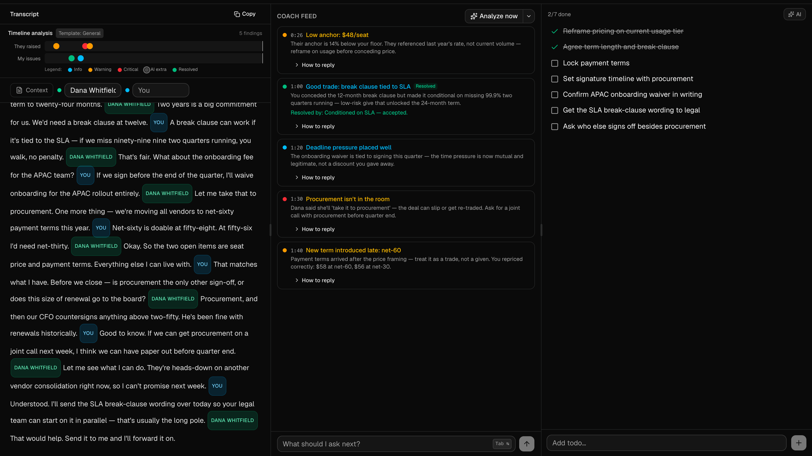
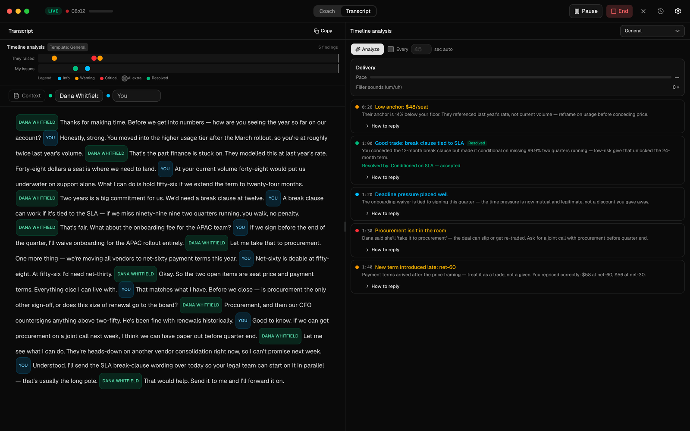
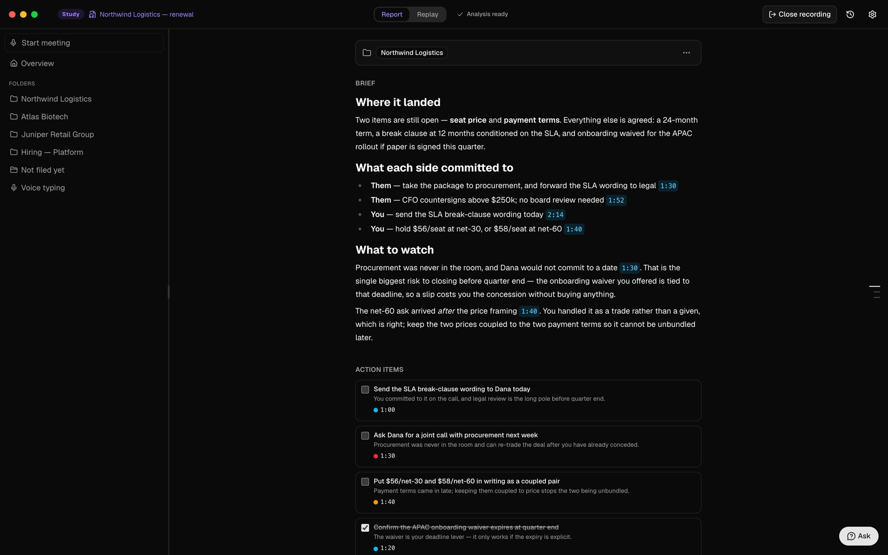

# Parley

<p align="center">
  
</p>

<p align="center">
  <strong>Record the meeting. Then hand it to the AI you already use.</strong>
</p>

<p align="center">
  <a href="https://github.com/pathorsAI/parley/releases/latest"></a>
  <a href="https://github.com/pathorsAI/parley/actions/workflows/release.yml"></a>
  <a href="LICENSE"></a>
  <a href="https://tauri.app/"></a>
  
</p>

<p align="center">
  
</p>

Parley does four things: **record, transcribe, analyze, search**. It captures both sides of a call, gives you a speaker-labelled transcript live, writes a debrief when the meeting ends, and makes every word you have ever recorded searchable.

Then it opens all of it over a local **MCP server** — 52 tools — so Claude, Claude Code, Cursor or any other MCP client can read, search, file and re-analyze your whole meeting history without a copy-paste in sight.

- 🎙️ **Both sides, live** — your mic and the meeting's system audio, transcribed and diarized as you talk.
- 📼 **A debrief that stays** — commitments, action items, findings on a timeline, and a delivery scorecard. Generated once, saved with the recording.
- 🔎 **Searchable forever** — full-text across every transcript line and every conclusion the analysis drew.
- 🔌 **Open by protocol** — anything the app can do to your library, an MCP client can do too, including owning the analysis outright.

**Local-first, bring your own keys.** Audio and transcripts go directly to the STT and LLM providers *you* configure (Claude, OpenAI, Gemini, Soniox, Deepgram, …). No Pathors proxy, no telemetry, everything stored on your machine.

> [!NOTE]
> **macOS only (for now).** Parley captures the other side of a call through a Core Audio process tap, which has no equivalent on other platforms. There are companion apps for [iPhone](https://apps.apple.com/app/id6795031201) and Android that record in-person meetings and sync to the same account.

---

## 📥 Install

Download the latest build from the [**Releases page**](https://github.com/pathorsAI/parley/releases/latest), open the `.dmg`, and drag **Parley** into Applications. Builds are signed and notarized — no Gatekeeper hoops.

Then paste your API keys in **Settings**: one STT provider for transcription, one LLM for analysis and Ask. Or sign in and use the hosted providers with no key to manage.

---

## 🎙️ During the call

<p align="center">
  
</p>

Starting a meeting is one button. Parley captures both sides — your mic and the meeting's system audio — and transcribes them live, diarized as `me` / `them`, with editable speaker names.

Describe the meeting in its **context field** — who is in the room, what is at stake, what you want the analysis to watch for — and that description goes verbatim into every analysis prompt for the recording. It is also the field an MCP client writes to when it wants to re-aim the analysis.

Beside the transcript sits the **coach feed**: evaluation alerts from your own templates (negotiation risk, qualification gaps, red flags, or whatever rubric you wrote), each with a drill-down into *how to reply*, plus an agenda checklist that ticks itself off as the conversation covers it. Ask anything from the input bar and get answers grounded in the conversation so far.

---

## 📼 After the call

<p align="center">
  
</p>

Stopping a meeting lands on its debrief. Any recording — just finished, pulled from history, dragged in as an audio file, or imported as a `.txt` transcript — opens in two views:

- **Report** — one scroll: the debrief with clickable timestamps, both sides' commitments, action items, and your delivery scorecard (measured pace, talk share, filler sounds).
- **Replay** — the full player: scrub to any moment and re-run the analysis *as of that point*, click through findings on the timeline, and ask anything about the call from a drawer that follows you across tabs.

Everything generates once and saves with the recording — reopen it a month later and the whole report loads instantly, no extra LLM calls. **LLM speaker re-attribution** fixes diarization drift by conversational context.

---

## 🗂️ Between calls

One customer, one folder. Every recording is filed in a folder — moved from the library, from the replay titlebar, or by an MCP client — so the calls with one customer sit together instead of scattering across a flat list. Sign in and a folder can live on the shared organization side instead of your personal one.

`search_meetings` runs full-text across everything you have recorded: every transcript line (each hit carrying a seek target) plus every brief, finding, action item and meeting context. Scope it to one folder to ask a question about one customer.

---

## 🔌 The MCP server

Parley runs a local Model Context Protocol server. Point your MCP client at it — the app has to be open — and it gets the live meeting, every saved recording, and the whole filing system:

```bash
claude mcp add --transport http parley http://127.0.0.1:3011/mcp
```

The exact endpoint, a ready-to-paste command, and a live view of what your client is doing are in **Settings → MCP Server**. 54 tools, in six groups:

| Group | What it reaches | Tools |
| --- | --- | --- |
| **The meeting happening now** | What is on screen, what has been said, the checklist beside it | `get_app_context`, `get_focused_content`, `get_transcript`, `list_todos`, `add_todo`, `check_todo`, `list_evaluations` |
| **Everything you have recorded** | Full-text search and full reads across history, on this device and your others | `search_meetings`, `list_recordings`, `get_recording`, `rename_recording`, `list_cloud_recordings`, `download_cloud_recording` |
| **The library, organized** | Personal folders, filing, bulk text import, deletion | `list_folders`, `create_folder`, `rename_folder`, `delete_folder`, `move_recording_to_folder`, `import_transcript`, `delete_recording` |
| **Your team's shared space** | The org side, with the same permissions the app enforces | `list_orgs`, `list_org_recordings`, `list_org_folders`, `create_org_folder`, `share_recording_to_org`, `move_org_recording_to_folder`, `copy_org_recording_to_personal`, `delete_org_recording` |
| **Hand over the analysis** | Writing findings, action items and the debrief back into the app | `set_recording_analysis`, `update_recording_meta`, `list_findings`, `set_findings`, `update_finding`, `upsert_eval_template`, `upsert_todo_template` |
| **How dictation spells things** | The voice-typing phrase dictionary — product names, jargon, people | `list_dictionary_phrases`, `add_dictionary_phrase`, `update_dictionary_phrase`, `delete_dictionary_phrase` |

**Letting an external AI own the analysis.** Turn off **Auto-analyze recordings** in Settings and a finished or imported recording stays unanalyzed on purpose. An agent polls `list_recordings` with `since` / the `analyzed` flag, reads the transcript, and writes its own findings, action items and brief back with `set_recording_analysis` — stamping `author` so its findings stay distinguishable from Parley's own pass. Manual regeneration still works either way.

---

## 🔒 Privacy

Conversation content is sensitive, so Parley runs straight from your machine:

- **Direct connections** — audio and transcripts go only to the providers you configure, under your own keys.
- **Local storage** — recordings, transcripts, and templates stay in your local app directory.
- **No telemetry** — nothing tracked, collected, or uploaded.

---

## 🎁 Also in the box

- **Voice typing** — system-wide push-to-talk dictation in any app, using your configured STT provider. Hold a key (default <kbd>Option+Space</kbd>), speak, release — the text pastes into the frontmost app.
- **Import what you already have** — drag in an audio file, or import a pile of `.txt` transcripts (speaker labels and `[HH:MM:SS]` timestamps are auto-detected) straight into the right folder.
- **Reusable playbooks** — evaluation and checklist templates: MEDDICC, negotiation terms, interview rubrics, diligence questions, or your own.
- **Traditional Chinese** — full zh-TW UI and on-the-fly conversion of transcribed text.

---

## 🛠️ Build from source

Requires **Rust** (stable) and **Bun** (or Node.js):

```bash
git clone https://github.com/pathorsAI/parley.git
cd parley
bun install
bun run tauri dev
```

Before opening a PR, `bunx tsc --noEmit` and `bunx vitest run` must both pass. See [CLAUDE.md](CLAUDE.md) for the repository conventions.

---

## 🤝 Contributing

Contributions are welcome! See [CONTRIBUTING.md](CONTRIBUTING.md) for how to report bugs, suggest features, and submit pull requests.

## 📄 License

Licensed under the [Apache License 2.0](LICENSE). Copyright 2026 Pathors AI.
